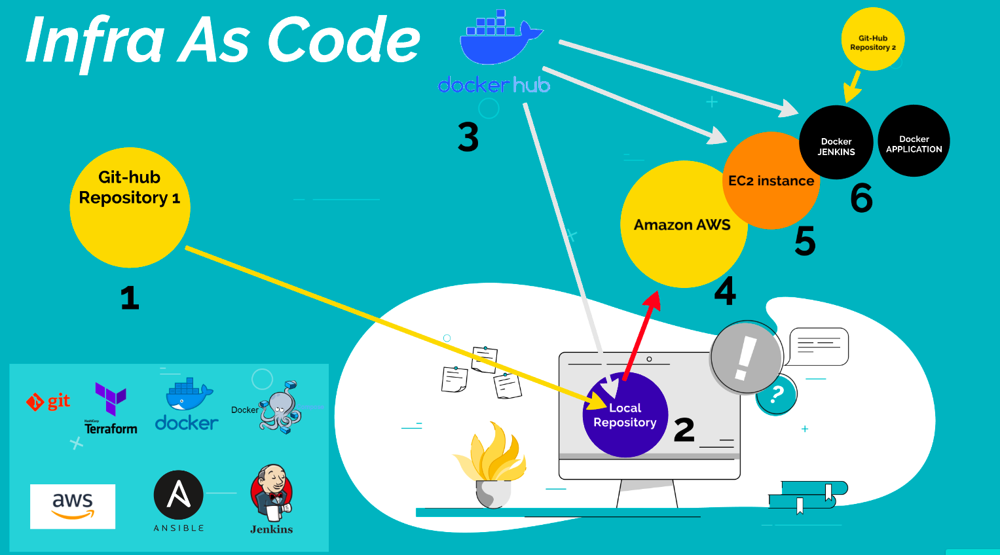

# Terraform_Aws_Ansible_Docker_Jenkins

### - Requisitos

- Git instalado
- Docker instalado
- conhecimentos básicos Aws

### - Instalação

- configurar as credentials Aws
- na pasta terraform, executar o comando: ./install.sh

